# Maid-in-Korea

Maid-in-Korea는 국내 메이드 카페 정보를 한곳에서 확인하고, 카페 운영자와 메이드가 각자의 정보를 관리할 수 있도록 만든 웹 서비스입니다.

사용자는 메이드 카페 목록과 상세 정보, 월별 스케줄, 메뉴, 소속 메이드 정보를 조회할 수 있습니다. 메이드는 프로필과 피드를 관리하고 카페 초대를 수락하거나 거절할 수 있습니다. 관리자는 자신의 카페 정보, 메뉴, 월별 영업/근무 스케줄, 메이드 초대를 관리합니다.

## 프로젝트 구성

```text
Maid-in-Korea/
├── README.md             # 프로젝트 전체 소개 및 실행 가이드
├── README-images/        # 화면 설계 및 README 이미지
├── frontend/             # React + Vite 프론트엔드
└── backend/              # Spring Boot 백엔드 API 서버
```

## 주요 기능

### 일반 회원

- 회원가입, 로그인, 토큰 재발급
- 메이드 카페 홈 목록 조회
- 카페 상세 정보 조회
- 카페 월별 스케줄 조회
- 커뮤니티 게시글 작성, 조회, 수정, 삭제
- 마이페이지 회원 정보 조회, 수정, 탈퇴

### 메이드

- 메이드 회원가입, 로그인
- 메이드 프로필 생성, 조회, 수정, 삭제, 비활성화
- 메이드 피드 작성, 조회, 수정, 삭제
- 카페 초대 목록 조회
- 카페 초대 수락 또는 거절

### 관리자

- 관리자 로그인
- 관리자 정보 조회
- 카페 기본 정보 수정
- 월별 영업 시간 및 메이드 근무 스케줄 임시 저장, 수정, 발행
- 메뉴 등록, 수정, 삭제
- 메이드 초대 발송
- 보낸 초대 목록 조회

## 기술 스택

### Frontend

- React
- Vite
- TypeScript
- TailwindCSS
- React Router
- Radix UI / shadcn 스타일 UI 컴포넌트
- MUI Icons, lucide-react

> 프로젝트 기준 기술에는 Redux가 포함되어 있으나, 현재 소스에는 Redux store 설정이나 관련 의존성이 아직 연결되어 있지 않습니다.

### Backend

- Java 21
- Spring Boot 4
- Spring MVC
- Spring Security
- Spring Data JPA
- MySQL
- Redis
- JWT
- OAuth2 Client, Kakao OAuth
- Swagger / Springdoc OpenAPI
- Gradle

## 실행 방법

### 1. 백엔드 실행

백엔드는 MySQL, Redis, Kakao OAuth, JWT 환경 변수가 필요합니다.

```bash
cd backend
./gradlew bootRun
```

필수 환경 변수:

```bash
DB_URL=jdbc:mysql://localhost:3306/{database_name}
DB_USER={mysql_user}
DB_PW={mysql_password}
JWT_SECRET_KEY={jwt_secret_key}
KAKAO_REST_API_KEY={kakao_rest_api_key}
KAKAO_REST_API_SECRET={kakao_rest_api_secret}
REDIS_HOST=localhost
REDIS_PORT=6379
REDIS_PASSWORD=
```

기본 백엔드 주소:

- API 서버: `http://localhost:8080`
- Swagger UI: `http://localhost:8080/swagger-ui/index.html`

### 2. 프론트엔드 실행

```bash
cd frontend
npm install
npm run dev
```

기본 프론트엔드 주소:

- Vite dev server: `http://localhost:5173`

프론트엔드 개발 서버는 `/api`, `/auth`, `/oauth` 요청을 `http://localhost:8080` 백엔드로 프록시합니다.

## 주요 화면

### 일반 회원 / 메이드 화면

#### 로그인 / 회원가입

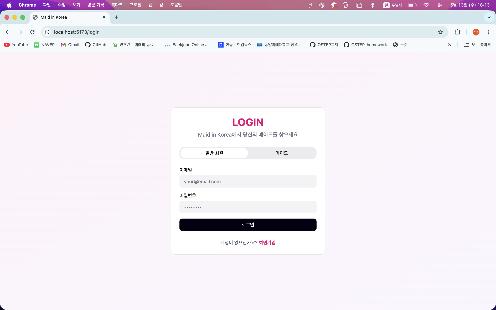
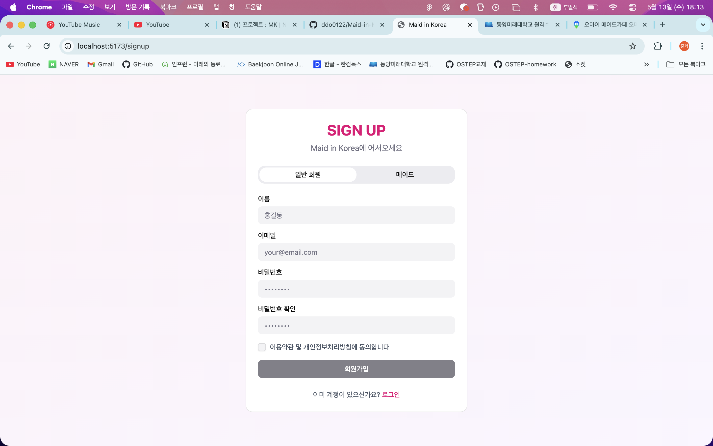

#### 홈

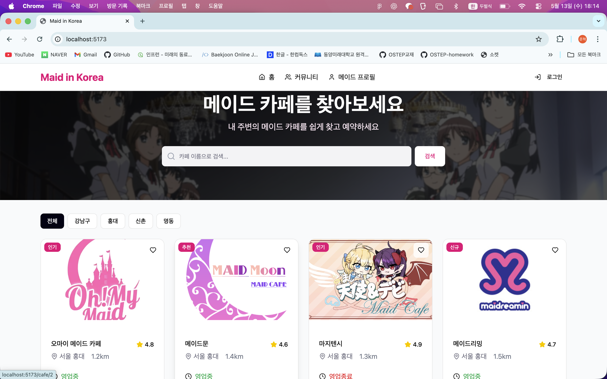

#### 메이드 카페 상세

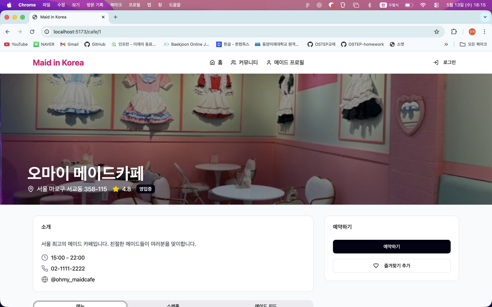
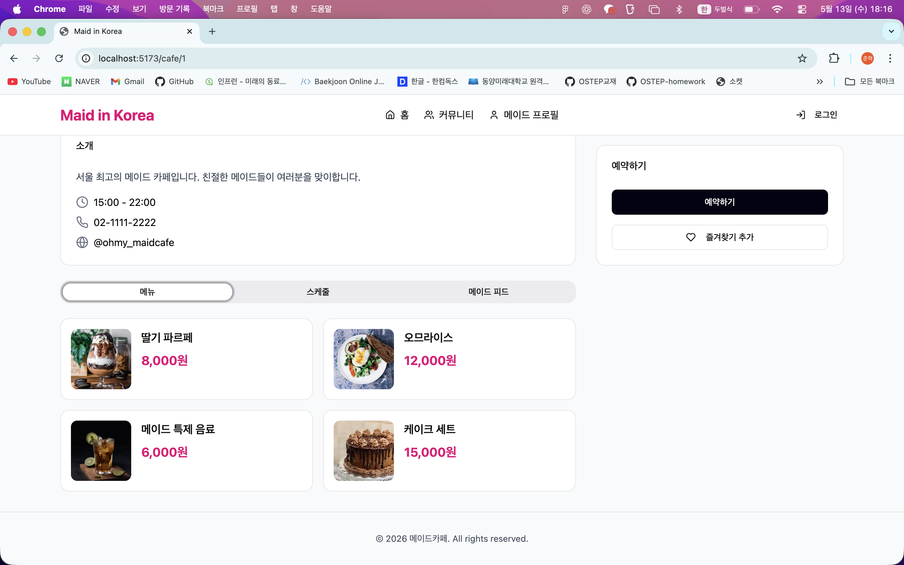

#### 커뮤니티

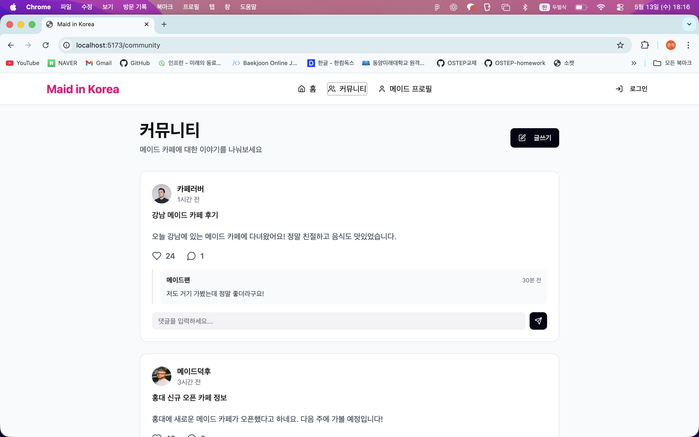

#### 메이드 프로필

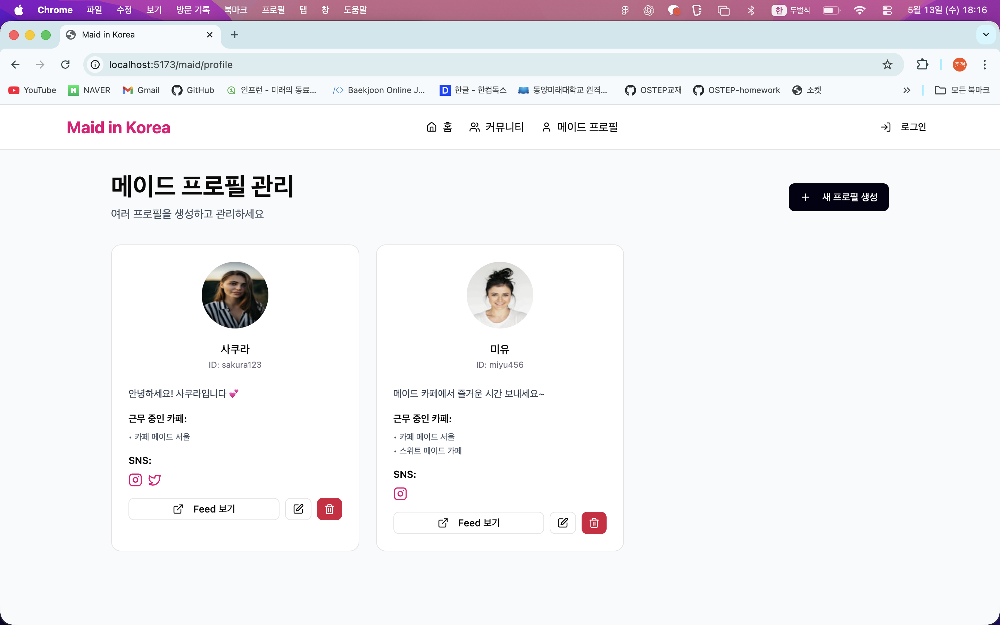

#### 메이드 피드

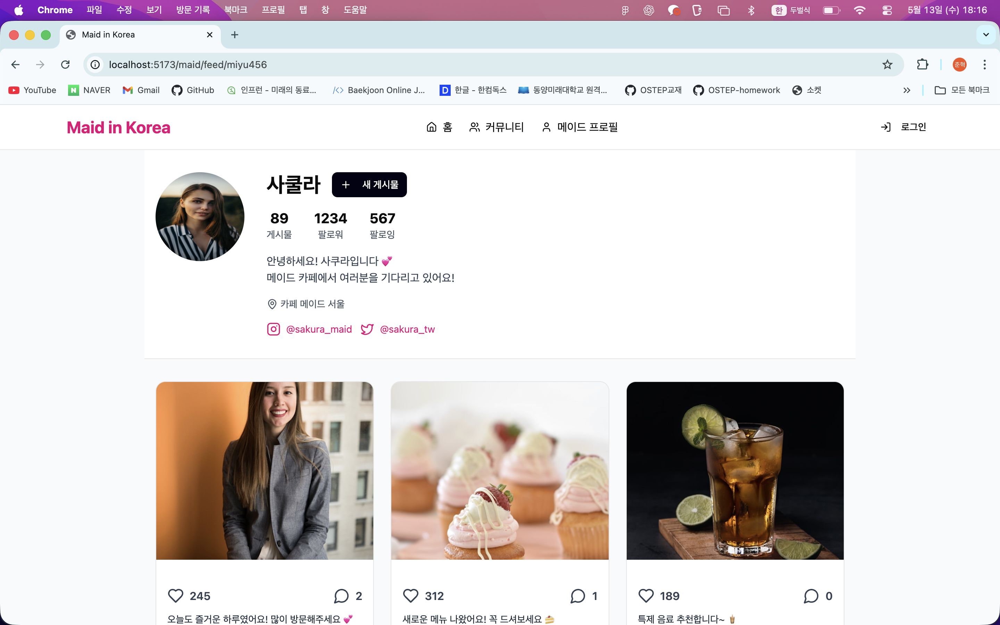

### 관리자 화면

#### 관리자 로그인

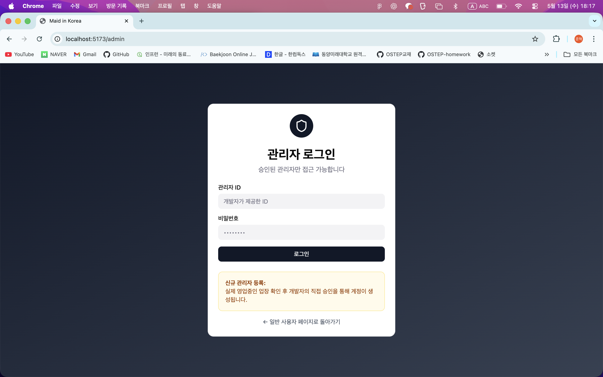

#### 관리자 대시보드

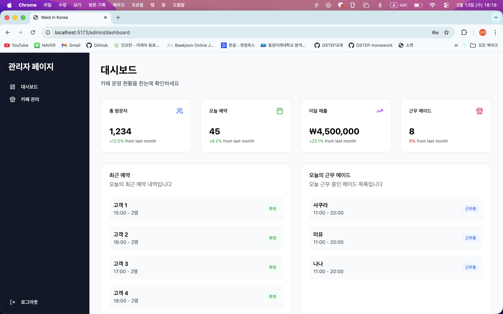

#### 카페 관리

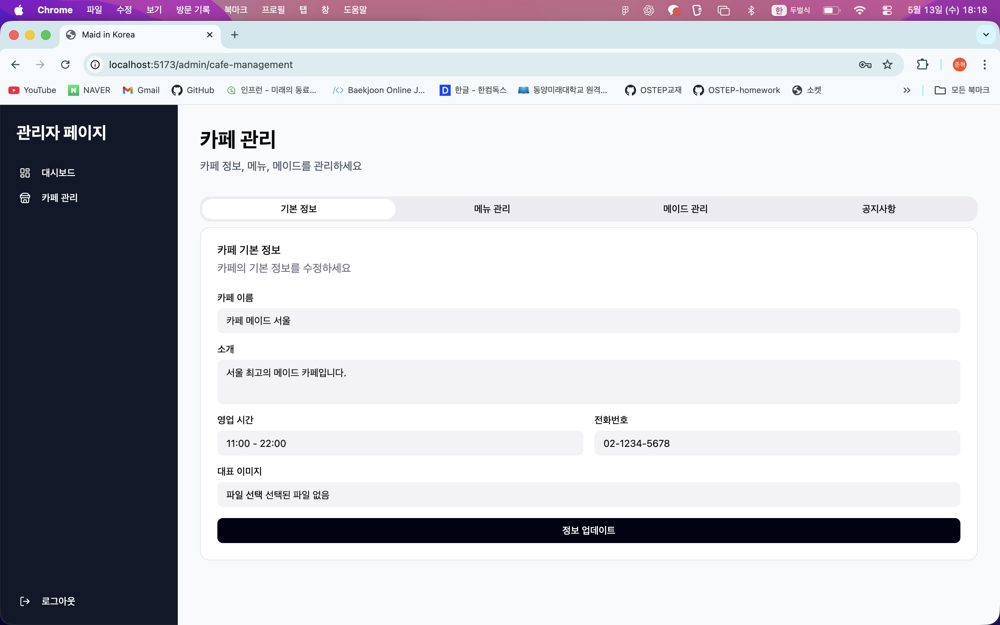

## 문서

- [프론트엔드 README](frontend/README.md)
- [백엔드 README](backend/README.md)
